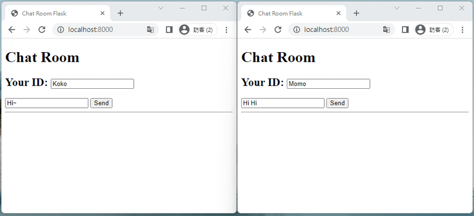

# chat-room

Use Python FastAPI + socket.io + Kafka

##  Virtual environment

- Creating virtual environment

  ```
  $ python -m venv venv
  ```

- Activate virtual environment

  ```
  $ .\\venv\\scripts\\activate # On Windows
  ```

* Install packages

  ```
  $ pip install -r requirements.txt
  ```

## Install Kafka

- Make sure you have docker environment  ( [Get Docker](https://docs.docker.com/get-docker/) )

  ```
  # Start the Kafka broker
  $ cd kafka
  $ docker-compose up -d
  ```

##  To run the application

```
$ uvicorn main:app --reload
```

##  Demo




##  References

* [FastAPI-WebSockets](https://fastapi.tiangolo.com/advanced/websockets/)
* [fastapi-socketio](https://github.com/pyropy/fastapi-socketio)
* [Apache Kafka producer and consumer with FastAPI and aiokafka](https://iwpnd.pw/articles/2020-03/apache-kafka-fastapi-geostream)

